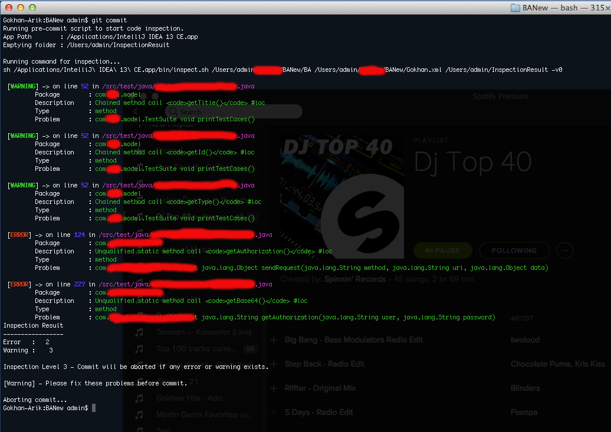

git-hooks
=========

Parameters
===========

This hook will run IntelliJ Inspect Code script every time you commit and check your project if any error or warning exists.
It is designed for MAc only.

In this hook, IntelliJ's Inspect Code takes 4 arguments: 

`@ide_path`               - Location of your IntelliJ IDEA. It will check `Applications` folder by default. It will exit if it can't find.

`@app_path`               - The script will search main directory, where .git located, and its parent directory to find `.iml` file. 

`@inspection_template`    - This is the template for code inspection. You can define your own from Intellij IDEA going Settings > Inspections and export it. It has to be in the same directory with `.git` and named `Default.xml`

`@inspection_result_dir`  - This is the folder where inspection results will be kept. The script creates directory called `InspectionResult` in users `home` folder. If folder is full, it deletes all the files in folder when script starts.

`@options`                - These are log options for IntelliJ Code Inspection script.

Detailed information about IntelliJ Code Inspector : http://www.jetbrains.com/idea/webhelp/running-inspections-offline.html

Levels
======

There are 3 levels in the script.

Level 1 - Aborts commit if any Error exists.

Level 2 - Aborts commit if any Warning exists.

Level 3 - Aborts commit if any Error or Warning exists.

The script is set to Level 3 by default.

Screenshot
==========

